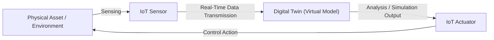

# Digital Twin Technology

## 1. Introduction

Efforts to reproduce and utilize real-world information in virtual space have been ongoing for a long time. The concept of the **Digital Twin** is a technological embodiment of this goal, connecting the physical and virtual worlds by creating an identical digital replica of a real-world system. This concept originated during NASA’s Apollo missions and has evolved into a framework that simulates and predicts future scenarios based on accumulated data, now bringing innovation across fields such as healthcare and space exploration.

With the technological advancements of the 21st century, digital twins have entered a phase of practical implementation. The explosive growth in real-world data collected through **IoT** sensors has enabled digital twin models to reflect these changes in real time, achieving **bidirectional synchronization** between the physical and virtual. In addition, as the application of artificial intelligence (AI) in industrial fields increasingly requires precise digitalization of the physical world, the digital twin has become a **crucial component for leveraging advanced AI**. Industries such as manufacturing, construction, energy, and smart cities are actively adopting digital twin technology. Today, the digital twin is recognized as a key technology that connects reality and the virtual domain. This report outlines the fundamentals and components of digital twin technology, its integration structure with IoT, representative enterprise cases, and emerging technology trends and prospects.

## 2. Overview of Digital Twins and Core Technologies

A **digital twin** refers to a virtual replica that accurately reproduces a real-world object, system, or process within a digital environment, including its context. By continuously receiving real-time data from sensors and systems attached to physical objects, the virtual model evolves as a “living” entity that stays synchronized with the current state and behavior of its physical counterpart. This enables users to simulate or analyze real-world scenarios through the twin, helping them better understand complex systems and make optimal decisions.

To implement digital twins, a convergence of several **core technologies** is required. The main components are as follows:

* **IoT and Sensors:** Devices in the **Internet of Things (IoT)** and various sensors that collect data from physical environments function as the **circulatory system** of digital twins. These devices measure information such as temperature, pressure, location, and motion in real time and transmit it over networks to the twin model. Digital twins are continuously updated with this **real-time sensor data**, accurately reflecting the status of physical assets. For example, IoT sensors attached to equipment in a smart factory send data such as utilization and vibration levels to the cloud, allowing the twin to immediately update the status of the virtual equipment. With the introduction of high-speed communication (e.g., 5G), large volumes of IoT data can now be transmitted without delay, enabling **real-time connection** between the physical and virtual worlds.

* **BIM (Building Information Modeling):** **BIM** technology involves creating 3D models with attribute data for buildings and infrastructure, and it plays a crucial role in implementing digital twins in the construction sector. **BIM data generated during the design and construction phases** can be used in the post-construction stage for building operation, maintenance, and facility services. When combined with digital twins, this allows for **full lifecycle management** of the asset—from initial design to end-of-life. In other words, by integrating the detailed 3D object data (e.g., walls, columns, equipment) provided by BIM with real-time operational data collected by IoT sensors, it is possible to construct a dynamic model that covers the past, present, and future states of a building or facility. While BIM has mainly been used as a collaboration tool in the **design and construction** phases to reduce errors, its integration with digital twins extends its value to include the **operational phase** as well.

* **AI and Data Analytics:** **Artificial intelligence (AI)** and machine learning (ML) are key technologies that provide **intelligence** to digital twins. By analyzing the massive volume of data generated from the twin, AI enables not only monitoring but also **prediction** and **optimization**. For example, applying machine learning algorithms can automatically detect patterns or anomalies in sensor data and issue warnings for potential issues before they occur. It can also simulate and suggest optimal operation plans. Industrial companies like GE have already implemented **predictive maintenance services** by applying advanced analytics and ML techniques to their digital twin software, enabling real-time monitoring and failure prediction of massive industrial datasets. In this way, the integration of AI allows digital twins to perform functions approaching **autonomous decision-making**, evolving into **smart twins** that can assess conditions and forecast the future without human intervention.

## 3. Integration Structure and Flow Between Smart IoT and Digital Twins

A digital twin serves as a **bridge between the physical and virtual worlds**, making it critical to understand how data from the physical environment flows into the virtual model and is then fed back into the real world. Typically, **smart sensor devices** represented by IoT and digital twin platforms are connected in a **bidirectional** manner. Data collected by sensors in physical space is instantly transmitted via network (edge/cloud) to the digital twin. The twin then updates its virtual model or runs simulations based on this data. The resulting **insights and predictions** are fed back into the real-world systems, where they support device control and operational decision-making. The diagram below illustrates a typical data flow between smart IoT and digital twins:

In the above diagram, physical assets are continuously monitored through IoT **sensors**, which transmit collected data to the **digital twin platform**, keeping the virtual model up to date. The digital twin analyzes this data or, when needed, performs **virtual simulations** to extract **insights** (e.g., anomaly detection, predictive outcomes) and sends these in the form of commands to **actuators** attached to the physical system. The actuators apply control signals (e.g., adjusting equipment settings) to **affect real-world systems**. In this way, the **sensor–twin–actuator** cycle creates a cyber-physical feedback loop that tightly connects the real and virtual worlds, enabling continuous synchronization and optimization.

## 4. Case Studies of Leading Companies

Numerous global companies have developed platforms and solutions by applying the digital twin concept to their respective areas of expertise. Below are case studies of some representative companies.

* **Autodesk:** A leading software company in the architecture, engineering, and construction (AEC) sector, Autodesk offers **building digital twin** solutions based on BIM technology. For example, the *Tandem* platform by Autodesk builds a **digital twin of building assets** in virtual space by linking 3D BIM models created during the design phase with various types of data generated throughout the project lifecycle. Even after completion, operational data is continuously collected via IoT sensors and reflected in the virtual model. This allows for **fine-tuning and optimization** of building performance, as well as predictive maintenance. The use of digital twins in this manner helps **shorten the building readiness period**, enhance **occupant convenience**, and improve the **performance of the entire portfolio** by systematizing building asset data.

* **Siemens:** Siemens provides **comprehensive digital twin** solutions across manufacturing and industrial automation domains. The company enables **design, simulation, and optimization** of the entire process from product design to production lines and plants within virtual environments, allowing problems to be identified and improvements made prior to actual implementation. This contributes to solving industry challenges such as **managing complexity**, **shortening development cycles**, and **enhancing quality and sustainability**. Siemens' digital twin technology is used across diverse fields including aerospace, automotive, and factory automation. (※ Siemens is also known for implementing digital twins using its *MindSphere* IoT platform and integrating them with its product lifecycle management (PLM) software.)

* **Dassault Systèmes:** Dassault Systèmes offers a **Virtual Twin Experience** through its *3DEXPERIENCE* platform. It goes beyond simple mirroring to simulate the **entire lifecycle** of products and systems in real time. Starting from a 3D model in the early design stage, operational data is integrated throughout the manufacturing and usage stages to virtually represent not only the physical attributes of an asset but also its **behavior and evolution**. These twins encompass all stages from 'as-designed' to 'as-made' to 'as-used,' evolving in line with changes in the real world to provide **predictive insights**. This allows product developers to make more sustainable and innovative design decisions, and through **system simulation of interconnected virtual twins**, optimize complex processes (e.g., from production to distribution).

* **GE Digital:** GE’s digital business division, GE Vernova, specializes in applying digital twins to **industrial assets** such as power generation equipment and aircraft engines for **predictive maintenance** and performance optimization. For instance, digital twins of power turbines collect real-time data such as temperature and vibration from sensors and transmit it to the cloud, where **machine learning-based analytics** are performed to detect early signs of failure and enable maintenance before breakdowns occur. GE Vernova’s *SmartSignal* software is a key component in **operational data analysis** based on digital twins, monitoring the status of **critical assets** such as pumps, compressors, and turbine generators. GE has reported significant reductions in unexpected downtime and maintenance costs at power plants using SmartSignal, and is expanding its **APM (Asset Performance Management)** solutions to industries like oil & gas, manufacturing, and mining.

* **Microsoft:** Microsoft offers a platform for building digital twins in large-scale **connected environments** through its cloud IoT service, **Azure Digital Twins**. Using an open modeling language (DTDL), Azure Digital Twins allows users to **define and model** real-world spaces such as buildings, factories, stadiums, and cities as digital graphs. Through connections with IoT Hub and other services, various IoT device data can be linked and reflected in real time. These twin graphs operate as a **live execution environment**, recording state changes over time (with historical data) and enabling query-based deep analysis or simulation of the modeled environment. Insights derived from these digital twins can be used for operational optimization or **product/service innovation**. Microsoft actively supports its customers in using Azure Digital Twins to achieve **better product development**, **enhanced operational efficiency**, and **differentiated customer experiences**.

## 5. Technology Trends and Future Outlook

The digital twin domain is evolving rapidly, integrating with a variety of cutting-edge technologies such as AI, edge computing, and XR (Extended Reality), and is poised to drive future innovations. The key trends and prospects are summarized as follows:

* **Advanced AI Integration:** The integration of artificial intelligence has become increasingly sophisticated, resulting in the emergence of **smarter digital twins**. The use of **generative AI** is particularly notable; for example, large language models and deep learning techniques are being used to interpret massive volumes of **unstructured data** (e.g., maintenance logs, video footage) and reflect the results in twin models. Some research efforts are also focused on generating **synthetic data** to train twins to predict rare scenarios. Furthermore, AI is evolving to analyze the interrelationships between multiple twin models and perform **system-level optimization**, and even to **autonomously respond** to abnormal situations. In the future, digital twins equipped with AI are expected to move beyond simple replication and support **inference** and **decision-making** on par with human experts.

* **Edge Computing and 5G:** In terms of **network infrastructure**, the performance of digital twins is being significantly improved. The commercialization of **5G communications**, with its ultra-low latency and high bandwidth, enables the real-time synchronization of data generated by countless sensors, allowing it to be transmitted seamlessly to digital twins located remotely—and also for control commands to be sent back. Simultaneously, **edge computing** performs data processing near the source without relying on the cloud, enabling immediate **on-site responsiveness** and reducing network load. This is especially useful in environments that require fast data processing and control, such as factory automation and **smart cities**. For example, digital twins of autonomous vehicles can be analyzed in real time by edge servers on road infrastructure, enabling millisecond-level responses to hazards. Remote medical monitoring twins can transmit patient data without delay via 5G, with urgent decisions made by edge AI. The combination of 5G and edge computing is expected to significantly expand use cases of digital twins that demand **real-time performance** and **reliability**.

* **XR Convergence and Industrial Metaverse:** The convergence of **Extended Reality (XR)** and digital twins is emerging as a key element in building the **industrial metaverse**. **Augmented Reality (AR)** devices can overlay digital twin data on real-world equipment, allowing workers to view internal system states and predicted behaviors in real time and make decisions more intuitively. For example, a maintenance worker wearing AR glasses can simply look at equipment and see its **status indicators** and **repair procedures**, enabling diagnosis and action without complex manuals. **Virtual Reality (VR)** and **Mixed Reality (MR)** also combine with digital twins to allow **immersive simulations** or training exercises within 3D virtual spaces identical to the real world. This enables safe virtual testing of hazardous situations or remote collaboration among global experts within the same MR space. For example, a digital twin of an aircraft engine could be virtually disassembled in VR for maintenance training, or a building manager could inspect equipment while wearing HoloLens and collaborate with a remote expert. This integration of XR technology offers a **highly intuitive interface** for users, lowers the barrier to entry for digital twin use, and promotes the construction of **metaverse-style industrial environments** where real and virtual boundaries are blurred.

* **Market Growth and Future Outlook:** The economic impact of digital twin technology is also expected to be substantial. According to McKinsey, the global digital twin market is projected to reach **\$73.5 billion by 2027**, growing at a CAGR of nearly 60% from 2022. This growth is already supported by the increasing number of adoption cases across industries. In manufacturing, **smart factory** initiatives are making process twins increasingly common. In urban infrastructure, hundreds of global cities are adopting **urban digital twins** to optimize traffic and energy management. Other expanding sectors include energy infrastructure, healthcare (e.g., **patient digital twins** for personalized treatment), and logistics. At the same time, efforts toward **standardization** and **ecosystem development** are underway, aiming to solve interoperability and security issues between different platforms. Within a few years, digital twins are likely to become a **core infrastructure technology**, much like today’s cloud computing and IoT, bringing significant changes to our lives and industrial operations as the key tool that connects the real and virtual worlds.

## 6. References

1. "Azure Digital Twins." *Microsoft Azure*, n.d., [https://azure.microsoft.com/en-us/products/digital-twins](https://azure.microsoft.com/en-us/products/digital-twins).
2. "How Extended Reality (XR) Transforms Industrial Maintenance." *MicroMain*, 29 Nov. 2024, [https://www.micromain.com/extended-reality-xr-2/](https://www.micromain.com/extended-reality-xr-2/).
3. Jeon, Hyun-kyung. "The Core of Smart EPC, BIM-Based Digital Twin - 1. BIM and Digital Twin." *Samsung SDS Insight Report*, 8 Nov. 2023, [https://www.samsungsds.com/kr/insights/digital-twin-using-bim-part1.html](https://www.samsungsds.com/kr/insights/digital-twin-using-bim-part1.html).
4. NASA Biological & Physical Sciences Division. "Why Does the World (and NASA) Need Digital Twins?" *NASA*, n.d., [https://science.nasa.gov/biological-physical/why-does-the-world-and-nasa-need-digital-twins/](https://science.nasa.gov/biological-physical/why-does-the-world-and-nasa-need-digital-twins/).
5. "Outperform Your Competition with a Comprehensive Digital Twin." *Siemens*, n.d., [https://www.siemens.com/global/en/products/automation/topic-areas/digital-enterprise/digital-twin.html](https://www.siemens.com/global/en/products/automation/topic-areas/digital-enterprise/digital-twin.html).
6. Rowshankish, Kayvaun, et al. "What Is Digital-Twin Technology?" *McKinsey & Company*, 26 Aug. 2024, [https://www.mckinsey.com/featured-insights/mckinsey-explainers/what-is-digital-twin-technology](https://www.mckinsey.com/featured-insights/mckinsey-explainers/what-is-digital-twin-technology).
7. Surender, Shweta. "Digital Twins Market Size: Comprehensive Growth Analysis 2024." *MarketsandMarkets*, 13 Sept. 2024, [https://www.marketsandmarkets.com/blog/SE/digital-twins-market-size-comprehensive-growth-analysis-2024](https://www.marketsandmarkets.com/blog/SE/digital-twins-market-size-comprehensive-growth-analysis-2024).
8. Swartzendruber, Tracy. "What Is a Digital Twin?" *GE Vernova Blog*, 22 Jan. 2025, [https://www.gevernova.com/software/blog/what-digital-twin](https://www.gevernova.com/software/blog/what-digital-twin).
9. Turney, Drew. "What Is a Digital Twin? Intelligent Data Models Shape the Built World." *Autodesk*, 11 Dec. 2024, [https://www.autodesk.com/design-make/articles/what-is-a-digital-twin](https://www.autodesk.com/design-make/articles/what-is-a-digital-twin).
10. "Virtual Twin Experiences." *Dassault Systèmes*, n.d., [https://www.3ds.com/virtual-twin](https://www.3ds.com/virtual-twin).
