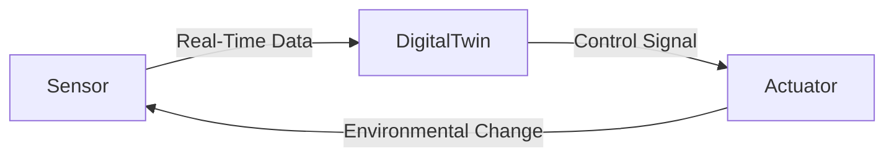

# Smart Building Digital Twin Development Process

In modern smart buildings, **Digital Twin** technology plays a pivotal role in efficient facility operation and management. A digital twin is a real-time virtual replica of a physical building and its internal systems, synchronized with the real world through a combination of technologies such as IoT sensors, 3D modeling, and AI. This allows building operators to monitor current status in real time, simulate various scenarios in a virtual environment, and make optimized decisions based on predictive analytics. For instance, digital twins can be used to forecast equipment failures months in advance or reduce energy usage by up to 40%, according to published reports. This document outlines the concept, development process, and technologies used at each stage of digital twin implementation in the context of smart buildings.

## 1. Overview of Digital Twin

In simple terms, a digital twin is a **real-time virtual replica of a physical object or system** in the real world. In the context of smart buildings, a digital twin integrates structural, equipment, and environmental data into a virtual model that is used to manage the **entire lifecycle from design to operation**. While traditional BIM (Building Information Modeling) provides a 3D information model of the building, digital twins take it a step further by adding **dynamic models linked to real-time sensor data**, enhancing the functionality of BIM. This allows building managers and stakeholders to **view and control the real-time state of a building as if looking into a mirror** within a virtual space.

Smart building digital twins are especially tightly coupled with **IoT sensor networks**. Sensors installed throughout the building—measuring temperature, humidity, light levels, air quality, vibration, occupancy, etc.—send real-time data to the cloud or a local server where the digital twin model is maintained. For instance, data from motion detectors, temperature sensors, and smart meters are collected to monitor the building’s environmental and energy usage conditions. Additionally, data can be imported from existing operational technologies (OT) such as Building Management Systems (BMS) and SCADA platforms. All of this diverse information is integrated into the digital twin model to **accurately reflect the building’s current state**.

The core values provided by digital twins include **real-time monitoring**, **predictive optimization**, and **scenario-based simulation and validation**. With digital twins, facility managers can monitor energy usage, equipment status, and security conditions at a glance, identifying anomalies instantly. Predictive algorithms allow maintenance scheduling and **fault detection before failure occurs**, while AI-powered optimization can **maximize energy efficiency**. Furthermore, digital twins allow “what-if” scenario simulations in a virtual environment, validating strategies before deployment to reduce risk and improve building performance. For these reasons, digital twin technology is rapidly emerging as a key enabler of the Fourth Industrial Revolution across various industries, including smart buildings.

In summary, a **smart building digital twin** is a BIM-based virtual model of the facility that incorporates real-time IoT data and AI analytics, serving as a **mirror-like digital representation of the physical building**. This empowers operators to **visually inspect and control their buildings in a virtual environment**, making data-driven decisions that enhance both operational efficiency and safety.

## 2. Digital Twin Development Process (Data Collection, Modeling, Integration, Simulation, Operation)

To develop a digital twin for a smart building, it is necessary to follow a structured, multi-phase process. Typically, the workflow proceeds in the following sequence:
① **Data Collection → ② Modeling → ③ Data Integration → ④ Simulation → ⑤ Operation**.
Each stage is carried out in order, building upon the previous, and will be explained in detail in the following sections.

### 2.1 Data Collection

The starting point of digital twin development is the **collection of real-world data**. In smart buildings, a variety of **IoT sensors** and **devices** are responsible for this task. For instance, real-time data is provided by **temperature, humidity, illumination, and motion detection sensors**, power meters, HVAC system sensors, elevator status sensors, and CCTV cameras. In addition, data can also be imported from existing **Operational Technology (OT)** systems such as Building Management Systems (BMS) and SCADA, as well as from **access control systems**. External data that may affect building operation—such as weather forecasts or electricity pricing—also falls within the scope of data collection.

This stage emphasizes the importance of building a **sensor network**, configuring **edge devices**, and securing a **communications infrastructure**. Depending on the requirements, data is transmitted using LoRaWAN, Zigbee, Wi-Fi, or wired Ethernet, and is gathered by gateways or edge computing devices and forwarded to the cloud. The goal of this phase is to **continuously acquire high-quality data that reflects the actual condition of the building**, as this serves as the foundation for the accuracy and effectiveness of the digital twin.

### 2.2 Modeling

In parallel with data collection, the **digital model of the building is constructed in the virtual environment**. This involves creating a **3D information model (BIM)** of the building’s static structures and systems. For new buildings, BIM data created during the design and construction phases can be used. For existing buildings, **3D models are created using laser scanning or photogrammetry**. Leading BIM authoring tools such as **Autodesk Revit** are used to construct detailed 3D models encompassing structural, spatial, and mechanical systems. BIM goes beyond simple 3D shapes—it includes material properties, specifications, and relational information, making it a crucial framework for the digital twin model. Indeed, **“the starting point of a building digital twin is securing the BIM”** is a widely held notion. Preparing high-detail BIM data (LOD 300 or higher) during construction simplifies the transition to an operational digital twin later.

In addition to BIM, this phase may also involve **physical process modeling**. For example, energy simulation models may be developed to analyze a building’s energy performance, or thermodynamic models may be constructed to simulate HVAC system behavior. Dynamic modeling of people and material flows or elevator behavior may also be included. These tasks transform the digital twin from a mere static replica into a **dynamic model capable of mimicking real-world behaviors**.

To summarize, the modeling stage entails **constructing a virtual counterpart of the physical building**, starting with 3D BIM and incorporating a variety of physical and logical models. These will be linked to real-time data in the subsequent integration stage to become a fully functional digital twin.

### 2.3 Data Integration

Next, the previously developed **real-time data streams** and **digital model** are brought together in the **integration stage**. Because the collected data varies widely in type and format, it must be **standardized and normalized** for integration into the digital twin platform. For example, temperature readings from different sensors must be unified in units and format, and then linked to metadata such as building coordinates or equipment IDs. This process includes **data formatting, validation**, and the establishment of **data lakes or databases** to store the integrated information.

Smart building digital twin integration is typically carried out on **cloud platforms**. These include **Microsoft Azure Digital Twins**, **AWS IoT TwinMaker**, **Siemens MindSphere**, and **IBM Maximo**, among others. These platforms allow BIM models and real-time sensor data to be connected. For instance, **Azure Digital Twins** uses a spatial graph model to define relationships among components (spaces, equipment, sensors) and links incoming IoT data from Azure IoT Hub to the model to ensure synchronization between physical and digital assets. A real-world example is the One Manhattan West (OMW) building in New York, which used WillowTwin™ and Azure Digital Twins to **consolidate over 30 different data sources into a single unified building model**. This integration allowed architectural blueprints, equipment statuses, and environmental sensor data to be visualized and interpreted on a single dashboard, enabling operators to understand the entire building at a glance.

In this stage, **data flow design and processing** are also essential. Real-time stream processing pipelines are implemented to ensure timely and reliable updates to the digital twin, while edge devices may be used to perform pre-filtering and preprocessing tasks. The integrated output at this stage forms the **core body of the digital twin**, ready for simulation and operational applications in the following stages.

### 2.4 Simulation

One of the most powerful capabilities of digital twins is their ability to support **simulations in a virtual environment**. This stage involves using the digital twin model, which was fully integrated in the previous stage, to **experiment with various operational scenarios**. In the context of smart buildings, simulations can take several forms.

**First**, there is the use of simulations for **design verification**. For instance, a BIM-based building design can be virtually constructed within the digital twin environment to simulate human movement flows or energy circulation and identify potential design flaws. In a real-world case, OPPO’s headquarters in Shenzhen, China applied **Computational Fluid Dynamics (CFD)** simulations to its BIM model to analyze indoor and outdoor airflow and virtually verify whether the proposed design met thermal comfort requirements. These simulations enable early detection and resolution of issues that might otherwise go unnoticed during the design phase.

**Second**, there are **operational scenario simulations**, which are used to test hypothetical situations during actual building operations. For example, one might simulate how different HVAC control strategies stabilize indoor temperature if a floor's temperature spikes, or estimate evacuation times during an emergency event with large crowd movement. Since the digital twin serves as a **miniaturized replica of the real system**, it becomes a safe testing ground to explore a variety of safety and efficiency experiments. The results from such simulations can help **optimize operational policies** or improve emergency response strategies.

**Third**, there are **predictive analytics and optimization simulations**. When integrated with AI, the digital twin uses accumulated data to predict future trends or evaluate multiple control variable combinations to identify optimal outcomes. For example, in energy management, the digital twin can enable **intelligent energy management** by combining 24-hour usage monitoring data with simulation models. It may be used to find the most energy-efficient HVAC settings among various operational scenarios, or to optimize elevator traffic patterns to simultaneously minimize wait times and energy use.

The outputs of the simulation phase serve as **evidence-based input for decision-making**. Applying pre-validated configurations and strategies from the virtual world to real-world operations minimizes trial-and-error risks and allows for the safe experimentation of innovative ideas. In this way, digital twin simulations are a critical tool for enhancing operational efficiency and safety in smart buildings.

### 2.5 Operation

The final stage involves **applying the completed digital twin in actual building operations**. At this stage, the digital twin functions as a **real-time mirror** of the facility, supporting ongoing **situational awareness, control, and optimization**.

First and foremost, the digital twin serves as a **real-time monitoring dashboard**. Within the virtual model, it visualizes environmental and operational indicators across all floors and rooms, such as temperature, humidity, lighting conditions, air quality, equipment status, and security sensor data. For example, a WillowTwin-based platform might display a 3D model of the building, with overlays showing energy consumption by floor, HVAC zone temperatures, comfort achievement rates (e.g., 79% of thermal zones within comfort range), air quality indices, and active alarms—all on a single screen. Through this integrated monitoring, operators can **understand and manage building assets with unprecedented insight**. If a problem arises, it immediately triggers an alert in the digital twin, allowing operators to click on the relevant area to view detailed information or take remote action. For example, when a security sensor or smoke detector detects an anomaly, the digital twin flags the incident for rapid response. The system also enables continuous monitoring of elevator and energy system performance to proactively handle unexpected outages.

In addition, during the operational phase, the digital twin plays a central role in forming a **control feedback loop**. Beyond displaying information, it also **interacts with automation systems to issue control commands**. For instance, if the twin detects elevated CO₂ levels on the fifth floor through real-time analysis, it can immediately instruct the ventilation system to activate. Alternatively, based on AI-trained optimization algorithms, it can dynamically adjust lighting systems or elevator schedules in real time. Such **automated control** ensures that the building maintains optimal environmental conditions without requiring manual intervention.

Especially in the area of **predictive maintenance**, digital twins can detect abnormal equipment patterns early and trigger preemptive repairs or replacements. In one implementation, the digital twin detected early warning signs of failure **three months in advance**, prompting the replacement of a part before any service disruption occurred. This kind of **proactive servicing** helps prevent routine energy waste and safety incidents, greatly enhancing operational efficiency.

In summary, the operation phase of digital twin usage establishes an **autonomous cycle of real-time monitoring → analysis → control**. This allows the building to operate more safely and efficiently. For example, Brookfield’s One Manhattan West (OMW) building optimized its energy use through digital twin deployment, enabling sustainable operations and projecting **energy and greenhouse gas reductions of over 20%** for aging or newly acquired buildings. Thus, operational applications of digital twins bring benefits such as lower energy costs, extended equipment lifespans, improved tenant satisfaction, and **reduced operational risk**.

## 3. Technologies and Tools by Development Stage (e.g., Revit, Azure Digital Twins, SCADA)

Throughout the digital twin development process described above, various **technological stacks and software tools** are employed at each stage. Below is a summary of representative technologies and tools by phase:

### Data Collection Phase

* **Sensors and Devices:** Various IoT sensor devices such as temperature/humidity sensors, illumination sensors, motion sensors, smart power meters, HVAC system sensors, and CCTV cameras.
* **Networks and Gateways:** Communication protocols and infrastructures like Zigbee, Z-Wave, Wi-Fi, Ethernet, and LoRaWAN are used to transmit sensor data. IoT gateways or edge computers (e.g., Raspberry Pi, NVIDIA Jetson) collect and forward this data to the cloud.
* **BMS/SCADA Integration:** For data collection from existing Building Management Systems (BMS) or SCADA systems, protocols like OPC UA or Modbus gateways are used. SCADA (Supervisory Control and Data Acquisition) is widely used for remote monitoring and control, providing real-time building system data (e.g., pump pressure, valve status) to the digital twin.
* **Cloud IoT Platforms:** Platforms such as **Azure IoT Hub**, **AWS IoT Core**, and **Google Cloud IoT** manage devices and collect data securely via cloud uplinks.

### Modeling Phase

* **BIM Software:** Tools like **Autodesk Revit**, **Graphisoft Archicad**, and **Bentley Systems MicroStation** are used to create BIM models of buildings. Revit is widely used for its detailed 3D design and metadata capabilities, serving as a foundational model for building digital twins.
* **CAD and 3D Modeling:** Applications such as AutoCAD, 3ds Max, and SketchUp supplement BIM by modeling finer components, interior layouts, or surrounding environments.
* **Scanning and Survey Equipment:** For modeling existing buildings, **LiDAR scanners** and **drone-based photogrammetry** are used to obtain point cloud data, which is processed using software like Autodesk ReCap to generate 3D models.
* **Physical Modeling/Simulation Tools:** Engineering simulation tools such as **EnergyPlus** and **TRNSYS** (for energy modeling), **SAP2000** and **ANSYS** (for structural analysis), **Fluent** and **OpenFOAM** (for CFD), and **MATLAB/Simulink** (for control systems) are used to develop mathematical models of physical processes and integrate them into the digital twin.

### Data Integration Phase

* **Digital Twin Platforms:** Solutions such as **Azure Digital Twins**, **AWS IoT TwinMaker**, **IBM Maximo Application Suite (with Digital Twin modules)**, **GE Digital Predix**, **Siemens Xcelerator/Mindsphere**, and **Bosch IoT Suite** are used. These platforms allow representation of physical assets as digital models and link IoT data accordingly. For instance, Azure Digital Twins uses DTDL (Digital Twins Definition Language) to model spatial relationships and projects real-time telemetry onto a graph.
* **Cloud Infrastructure and Databases:** Integrated data is stored and processed in cloud databases (e.g., **Azure SQL**, **Cosmos DB**, **AWS DynamoDB**, **Time Series Insights**) or **data lakes**. Time series databases like **InfluxDB**, **AWS Timestream**, or **Azure Data Explorer** may be used for managing sensor logs.
* **Middleware and APIs:** For heterogeneous system integration, protocols such as **MQTT**, **AMQP**, **REST APIs**, and **GraphQL** are employed. For example, sensor data published by building-edge devices via MQTT can be subscribed to by cloud IoT hubs and reflected in the digital twin. APIs are also used to synchronize legacy asset management system data periodically.
* **Data Processing and ETL:** Stream processing engines like **Apache Kafka**, **Azure Stream Analytics**, **AWS Kinesis**, and orchestration tools like **Node-RED** are used to perform unit conversion, filtering, and aggregation, delivering clean, structured data to the twin.

### Simulation Phase

* **Simulation Engines:** While many digital twin platforms offer built-in simulation features, in some cases, external simulation engines are integrated. For instance, **energy simulations** may be performed using DOE-2-based engines or EnergyPlus, **evacuation simulations** with Pathfinder, **occupant flow simulations** using AnyLogic, and **environmental simulations** via CFD engines. These engines can be linked to the digital twin (e.g., by feeding real-time data into the engine and retrieving output), enabling more accurate simulations based on actual operational data.

* **AI/Machine Learning Tools:** Machine learning platforms are used to support prediction and optimization through simulation. These may range from Python-based frameworks like **TensorFlow** and **PyTorch**, to AutoML tools or cloud-based AI services such as Azure ML and AWS Sagemaker. For example, a model trained on historical sensor data can simulate future energy consumption, or reinforcement learning can be used to train HVAC control policies in a virtual environment.

* **Virtual Reality (VR) / Augmented Reality (AR):** To allow users to experience simulation results immersively, digital twins can be visualized and manipulated interactively through 3D engines like **Unity** or **Unreal Engine**. For instance, one could enter the digital twin of a building in VR and experience how scenarios unfold in order to verify simulation results firsthand.

### Operation Phase

* **Monitoring and Dashboards:** Operational interfaces include **SCADA/HMI software** or **business intelligence (BI) tools**. Solutions like **Microsoft Power BI** and **Tableau** are used to create real-time dashboards. Open-source tools such as **Grafana** or **Kepler.gl** may also be used for 3D visualization via web applications. In the case of Brookfield, a central platform using Power BI and a custom web app was employed to visualize sensor data linked to 3D BIM models.

* **Alarm and Notification Systems:** For anomaly detection during operations, alert servers or messaging services are used. When a sensor exceeds a threshold, platforms like Azure Logic Apps or AWS SNS can be configured to send alerts via **email, SMS, or mobile push notifications**.

* **Control Systems:** A technology stack is required to send control signals from the digital twin to real-world building equipment. HVAC, lighting, and elevator systems are typically controlled via **PLCs (Programmable Logic Controllers)** or **BAS (Building Automation Systems)**. Integrating these with the digital twin may involve OPC UA servers/clients, Modbus TCP, or other protocol gateways. Increasingly, **MQTT-based messaging** or **local edge computing devices** are used for more responsive control.

* **Data Analysis and AI Services:** Long-term optimization during the operational phase involves continuous use of big data analytics platforms and AI services. For instance, historical operation data can be analyzed using tools like Azure Databricks or AWS Redshift, while anomaly detection can be performed using Python libraries such as Scikit-learn or Prophet.

This section illustrates that each phase of the digital twin lifecycle requires a **tailored mix of tools**, forming a **multi-layered technical ecosystem**. In practice, some projects use turnkey commercial solutions (e.g., **WillowTwin**, **Dassault Systèmes 3DEXPERIENCE**, **Siemens Navigator**), while others mix open-source and proprietary tools based on project scale and organizational needs.

## 4. IoT and Smart Control Integration (Sensor–Twin–Actuator Feedback Loop)

To fully understand the functionality of smart building digital twins, it is essential to examine the **bidirectional integration structure** linking **IoT sensors → digital twin → control actuators**. The digital twin sits at the center of this structure, acting as a bridge between the **physical world** and the **digital world**. It ingests data from sensors, analyzes it, and translates the results into control commands—forming a **feedback loop**.

The following **flowchart** illustrates the real-time interaction between sensors, the digital twin, and actuators within a building environment:

As shown above, various **sensors** installed throughout the building continuously send data to the **digital twin**, which processes the input via decision-making logic or algorithms. When necessary, it sends commands to **actuators**—devices that alter the physical environment (e.g., increasing HVAC fan speed, opening/closing windows). These changes update the building’s actual state, which is then detected by sensors and looped back into the twin. This closed **cyclical structure** enables automated real-time monitoring, analysis, and control via the digital twin.

Smart buildings generally implement this integration using a **layered architecture**. Typically, sensors and actuators are connected through a **fieldbus-level control network**, and edge gateways collect the data and upload it to the **cloud-based digital twin platform**. The platform immediately **stores and processes** incoming data and, based on predefined rules or AI models, sends control commands back to the edge or field devices. For example, in Azure Digital Twins, Azure IoT Hub receives sensor telemetry from the building and forwards it to the corresponding twin instance. Azure Functions or Logic Apps can then be triggered to issue specific commands back to devices via the IoT Hub.

Key concerns in this architecture include **reliability and real-time performance**. Communication between sensors and the digital twin must be low-latency, and control commands must be executed safely and precisely. To achieve this, **edge computing** is employed to handle first-level processing and emergency control locally, while cloud twins focus on advanced analytics and optimization. From a cybersecurity perspective, it is also critical to apply **end-to-end security**, protecting data from IoT devices all the way to the cloud.

In summary, IoT and smart control integration enables digital twins to **aggregate diverse real-time data streams**, analyze them, and apply their results back into the physical environment. The digital twin functions as the “brain” in a system where the building itself is the “body,” facilitating constant bidirectional communication. Through tight integration of sensors, twins, and actuators, smart buildings become **self-adaptive** systems capable of responding autonomously to internal needs and external stimuli—delivering energy savings, comfort, safety, and efficiency.

## 5. AI and Digital Twin Convergence and Benefits (e.g., Energy Optimization, Predictive Maintenance, Autonomous Control)

The combination of **Artificial Intelligence (AI)** technology and digital twins elevates smart building operations to a far more **intelligent and optimized level**. AI learns from the vast amount of sensor data and the complex relationships within building systems—patterns often too subtle for humans to recognize—and applies **predictive and optimization algorithms** that significantly enhance the value of digital twins.

Most notably, the synergy between AI and digital twins shines in the area of **predictive maintenance**. For example, if AI is trained using historical sensor data from equipment such as chillers, fan coils, or elevators, it can **predict potential failures before they happen**. The digital twin applies this trained model to live data streams and can **issue early warnings** of abnormalities, recommending optimal maintenance times. One such model could be trained using vibration and current sensor data to detect abnormal oscillation patterns in a motor bearing, alerting managers **months in advance** to schedule a part replacement—reducing downtime and saving on parts and labor costs. Moreover, AI can perform **remaining useful life estimation** and **fault cause analysis**, supporting a truly **proactive maintenance strategy** for building management.

Another significant advantage of AI-integrated digital twins lies in **energy optimization**. Building energy consumption is influenced by weather, occupancy, and time of day—factors that AI can analyze simultaneously to produce **control strategies that minimize energy use**. For instance, a model trained on years of historical weather and indoor temperature data can forecast tomorrow’s thermal load and precompute HVAC operation schedules to maintain comfort while avoiding overuse. In practice, one factory reduced energy consumption by **40%** using an AI-powered digital twin, and smart buildings can expect similar levels of efficiency through AI-based control. In the One Manhattan West (OMW) building mentioned earlier, the digital twin leveraged AI analysis to **eliminate daily energy waste** and maintain optimal equipment efficiency, targeting energy reductions of **20% or more**.

AI-powered digital twins also unlock the possibility of **autonomous control**. This refers to minimizing human intervention, allowing the digital twin to assess and control building systems on its own. For instance, reinforcement learning agents can be trained in digital twin simulations across many scenarios to master control policies, which can then be applied to actual building systems for **autonomous equipment operation**. Google DeepMind has already demonstrated this by reducing data center cooling energy by more than 30% using AI autonomous control. Applied to buildings, this concept introduces the idea of an **AI facility manager** who fine-tunes lighting, ventilation, and temperature around the clock—better than a human. While full autonomy requires caution and accountability, **AI-assisted control** is already feasible. In some smart office buildings, for example, AI preconditions meeting rooms based on booking schedules or reduces elevator wait times based on learned commuting patterns. This kind of AI-driven automation **improves both user comfort and operational efficiency**—a clear win-win.

Moreover, the integration of AI with digital twins enables **deep analytical insights**. AI can uncover **hidden correlations and anomalies** in building-generated data that human analysts might overlook. For instance, subtle repetitive vibration patterns that precede a major malfunction can be detected, or energy usage peaks at certain times might be explained through behavioral analysis of tenants. With natural language processing (NLP), AI can also analyze unstructured data such as maintenance logs or occupant feedback, integrating this qualitative information into the twin for **holistic decision support**.

By combining AI with digital twins, building operators can achieve **predictive maintenance, energy optimization, and autonomous operations**—effectively hitting three major goals at once. Ultimately, this translates to reduced operating costs and improved service quality, benefiting both building owners and occupants. As NVIDIA CEO Jensen Huang stated, “To apply AI to the physical industries, we must first digitize everything—and that starts with digital twins.” Indeed, in the era of AI, digital twins form the foundation of intelligent building operations. With AI added on top, truly **autonomous, intelligent buildings** can be realized.

## 6. Digital Twin Implementation Examples and Visual Aids

To complement the concepts discussed above, this section introduces **real-world implementation examples and visual representations** of smart building digital twins.

The image above illustrates a conceptual example of an integrated architecture using Azure Digital Twins in Microsoft’s smart building campus. At the center is the Azure Digital Twins platform. On the left is the **Physical World**, which includes various devices within the buildings, and on the right is the **Digital World**, comprised of cloud services.

The physical layer features smart building systems such as **lighting, security, HVAC, and environmental sensors**. Data from these systems is collected and sent to Azure Digital Twins via Azure IoT. The aggregated data in the digital twin is then shared with **campus-wide solutions**, such as Azure services, Power Apps, Dynamics 365, Microsoft Teams, and Office 365. These services use the standardized and integrated digital model to operate across various domains like energy management, space utilization, and facility maintenance.

This visual example clearly shows how Azure Digital Twins serves not merely as a data management system, but as a **hub that unifies the physical and digital ecosystems**. Especially noteworthy is the way it aggregates telemetry data from tens of thousands of devices across the globe, organizing it by building and floor, and delivering it to enterprise applications such as Dynamics 365 and Power BI. This architecture **digitally transforms the entire building management process**, serving as a real-world model for companies aiming to implement digital twins.

The flowchart introduced in Section 4 and the Azure Digital Twins conceptual diagram together demonstrate that the digital twin is the **core mechanism bridging “data → information → insight/control”** within smart building operations. To summarize: sensors collect environmental data, which the digital twin contextualizes (e.g., “temperature = 28°C” + location → “meeting room on 5th floor slightly warm”). Then, through AI analytics, insights are derived and actions are initiated (e.g., “increase HVAC output in that room by 10%”). This system behaves **intelligently and autonomously**, aligning with operational goals.

Through these **real-world implementation examples and visual aids**, readers can better understand how the digital twin concepts previously introduced are applied in practice—and how they deliver measurable improvements in smart building performance.

## 7. Summary and Conclusion

The digital twin for smart buildings is transforming the paradigm of facility management by **connecting the virtual and physical worlds in real time**. This document has reviewed the concept of digital twins, their application in smart buildings, and has explained, step by step, the development process from **data collection → modeling → integration → simulation → operation**. To summarize:

* **Digital Twin Overview:** A technology that combines BIM-based 3D virtual models with IoT sensor data and AI analytics to recreate the real-time status and behavior of physical buildings. This enables real-time monitoring, predictive diagnostics, and scenario simulations.

* **Development Process:** Data is **collected** from sensors and systems, used to build a precise **virtual model**, and then **integrated** via cloud platforms. The resulting digital twin is used to run **simulations** in a virtual space, and ultimately applied in live building **operation and control**, forming a continuous feedback loop for optimization.

* **Technologies and Tools:** A broad range of technologies is involved at each phase—including IoT devices, networks, BIM/CAD software, digital twin platforms (such as Azure Digital Twins), databases, simulation engines, AI platforms, and dashboards/SCADA systems. Successful implementation requires **seamless integration and interoperability** across these heterogeneous tools.

* **IoT Integration Structure:** Smart building digital twins adopt a **closed-loop architecture**—from sensors to twin to actuators—where real-time data and control signals circulate continuously. This allows buildings to develop **self-adaptive capabilities** in response to internal and external changes.

* **AI Convergence:** When integrated with AI, digital twins enable predictive maintenance to prevent equipment failures, optimize energy usage to reduce costs, and approach **autonomous operation**. This enhances both occupant comfort and safety, and empowers facility managers to make **data-driven decisions** for improved outcomes.

In conclusion, the digital twin serves as the **“brain”** of the smart building. It remembers and learns everything that occurs within the physical building, making optimal decisions and orchestrating the operation of what is effectively a massive cyber-physical system. Of course, implementing digital twins requires significant initial investment and effort, along with challenges in data standardization, cybersecurity, and organizational collaboration. Nevertheless, leading companies and cities are embracing digital twins because their **tangible value has been proven**. In the smart building sector, digital twins are leading to **up to 50% improvement in energy efficiency**, significant reductions in maintenance costs, and increased occupant satisfaction.

By understanding the digital twin development process and leveraging appropriate tools and technologies, it is entirely feasible to realize **next-generation intelligent buildings**. Data-driven building management powered by digital twins will form the foundation of sustainable smart cities, contributing greatly to energy savings, carbon reduction, and the creation of safe and comfortable living environments. For anyone planning or managing a smart building, digital twins are no longer an option—they are a **strategic necessity**. The time has come to bridge the gap between the physical and virtual worlds, and move toward a truly smart building future.
