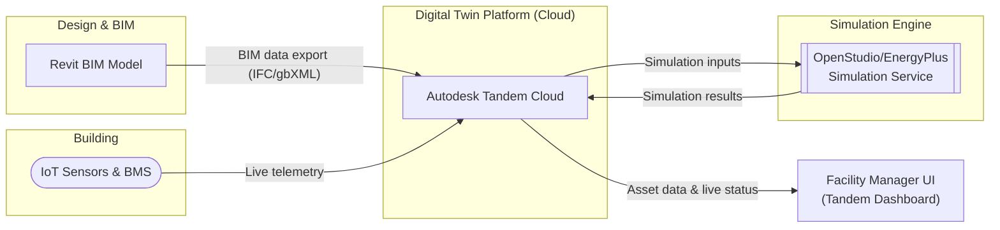
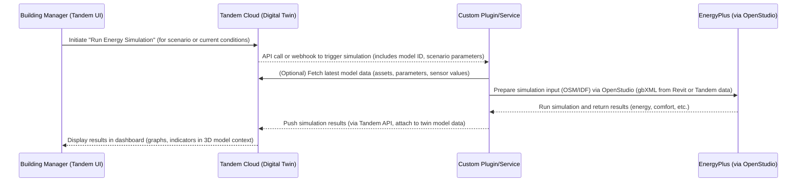

# Prototype Digital Twin Solution for Office Building Management

This document describes a prototype **digital twin** solution for office building management integrating **Autodesk Revit**, **Autodesk Tandem**, **EnergyPlus**, **OpenStudio**, and a custom-developed plugin. The goal is to provide building managers with a comprehensive platform for real-time monitoring, energy simulation, predictive maintenance, space utilization analysis, and equipment lifecycle tracking. The solution leverages BIM data from Revit, the cloud-based digital twin environment of Tandem, advanced energy modeling via EnergyPlus/OpenStudio, and custom plugins to connect these components.

## Introduction to the Digital Twin Approach

A *digital twin* is a **data-rich, interactive virtual replica of a physical asset**, mirroring the real building in both form and data. In the context of an office building, a digital twin consolidates BIM geometry, asset information, and live sensor data, providing a single source of truth throughout the building’s lifecycle. By centralizing and contextualizing building data, the digital twin enables holistic visibility into operations and performance.

&#x20;*Conceptual illustration of a digital twin for a building, visualizing real-time data (e.g., HVAC status, sensor readings, maintenance alerts) overlaid on the BIM model. Such a digital twin connects physical systems to their virtual counterpart, enabling monitoring and analytics.*

**Why a Digital Twin?** A digital twin transcends a static 3D model. It continuously **aggregates operational data** – such as HVAC status, temperature, occupancy, and maintenance records – into the BIM model, evolving with the building’s usage. Building managers can **explore live and historical data** through this virtual model, gaining insights into space conditions, equipment performance, and occupant usage patterns in a visual, intuitive manner.

According to Autodesk, as a digital twin matures it can progress from a **Descriptive Twin** (basic static model with data) to an **Informative Twin** (connected to IoT sensors for real-time visibility) and further into a **Predictive Twin** that leverages historical data for analytics and trend prediction. In other words, a fully realized digital twin not only mirrors current conditions but also uses data to **anticipate future events**, enabling proactive interventions (e.g. predicting equipment failures or energy peaks).

**Solution Overview:** Our prototype integrates several technologies:

* **Autodesk Revit**: the BIM authoring tool where the building’s architectural and MEP model is created and enriched with metadata.
* **Autodesk Tandem**: the cloud platform for hosting the digital twin, which ingests the Revit model and links to sensor data (Building Management System, IoT devices) in real time.
* **EnergyPlus**: a powerful physics-based building energy simulation engine used for analyzing energy performance and indoor environmental conditions.
* **OpenStudio SDK**: an open-source toolkit that provides workflows and API (in Ruby/C++) to facilitate creating and running EnergyPlus simulations, including translation of BIM data (e.g. from Revit’s gbXML export) into EnergyPlus input format.
* **Custom Plugin**: a bespoke software component (e.g. a Revit add-in or a middleware service) that orchestrates data exchange between Revit, Tandem, and the simulation engine. This plugin might automate model exports, push sensor updates, or trigger simulations based on events.

In the following sections, we detail the conceptual architecture, use cases for building managers, integration workflows, data flows, sample code, implementation steps, data integration considerations, and discuss the future scalability, benefits and limitations of the solution.

## Conceptual Architecture of the System

The digital twin system architecture involves interactions between the BIM environment, the digital twin cloud platform, real-time data sources, and the simulation engine. The diagram below illustrates the high-level architecture:



**Figure: System Architecture.** *Revit provides the BIM model to Autodesk Tandem (cloud). Tandem stores the digital twin (geometry + data). IoT sensors and the Building Management System (BMS) feed real-time data (telemetry) into Tandem. The Facility Manager interacts via Tandem’s dashboard to monitor conditions or request analyses. Tandem integrates with an external simulation service (OpenStudio/EnergyPlus) through a custom plugin or API to perform energy simulations using up-to-date data. Simulation results (e.g. predicted energy usage, thermal comfort metrics) are fed back into Tandem for visualization and decision support.*

Key components and their roles:

* **Revit (BIM Design)**: The source of truth for building geometry, spaces, and initially designed systems. The Revit model is enriched with asset metadata (e.g., equipment specifications, space IDs). A **Tandem Revit Add-in** is used to push the model to Autodesk Tandem, ensuring that the digital twin starts with an accurate as-designed BIM model. (Autodesk provides an official Revit <-> Tandem sync add-in.)

* **Autodesk Tandem (Digital Twin Cloud)**: Hosts the digital twin model, which includes the 3D geometry and a **database of assets and sensors**. Tandem acts as the integration hub where building data is aggregated. Tandem’s APIs (like Tandem Connect) allow linking external data streams (IoT sensors, BMS points) to corresponding assets in the model. This means as sensors report data (temperatures, equipment statuses, etc.), Tandem can update the virtual model’s parameters in real time. In our architecture, Tandem also stores simulation results or analytic data as additional properties of the twin.

* **IoT Sensors & BMS**: The physical data sources in the building (temperature sensors, occupancy counters, smart meters, HVAC controllers from the Building Management System). These feed real-time telemetry into the digital twin. For example, a thermostat sensor in a meeting room provides current temperature and occupancy status, which Tandem can display on the twin model for that room. Autodesk Tandem is designed to aggregate BMS data for studying the building’s operational performance.

* **OpenStudio/EnergyPlus Simulation Service**: This is the analytical brain of the system. EnergyPlus, developed by DOE/NREL, is a detailed building energy modeling engine capable of simulating HVAC, lighting, and thermal performance. It can handle analyses from detailed single-building twins to larger scale models. OpenStudio serves as a convenient interface to EnergyPlus, providing SDK and workflow automation. In this architecture, a custom integration (plugin or cloud function) takes data from Tandem (and/or Revit) and creates an EnergyPlus simulation model (IDF file) via OpenStudio. The simulation can be run on demand to evaluate *what-if scenarios*, perform continuous commissioning analysis, or verify performance against design.

* **Custom Plugin**: The glue connecting Tandem and EnergyPlus. There are a couple of possibilities for implementation:

  * A **Revit plugin** that can be triggered to export a gbXML (Green Building XML) or IFC representation of the building and send it to a simulation pipeline.
  * A **Tandem integration service** (using Tandem’s Data API) that listens for certain events (e.g., a manager requesting an energy analysis) and then programmatically launches an OpenStudio workflow.
  * An **OpenStudio Measure or script** that pulls updated info (like occupancy schedules or equipment settings) from Tandem, updates the simulation model, and runs EnergyPlus.

  For this prototype, we envision a service (or plugin) that receives a command (from the manager via Tandem UI or an external trigger), then uses the **OpenStudio API** to generate an updated model and run EnergyPlus, finally pushing results back.

* **Facility Manager UI**: Autodesk Tandem provides a web-based dashboard for facility managers to interact with the digital twin (view the 3D model, query asset info, see live sensor readings, track work orders, etc.). We leverage Tandem’s UI for most user interactions. Additionally, if needed, custom interfaces or mobile apps could be built on top of Tandem’s API for specific functionalities, but that's beyond this scope. In our use cases, the manager might use the UI to check alerts, view simulations, or initiate analyses (e.g., "simulate energy use if we reduce thermostat by 1°C").

**Data Connectivity:** The integration relies on data flows between these components:

* **One-time/Periodic BIM Data Sync**: from Revit to Tandem. (This may be periodic, e.g., design updates, or at project handover. The Tandem add-in ensures any design changes can be reflected in the twin model.)
* **Continuous Sensor Data Stream**: from IoT/BMS to Tandem (through Tandem’s IoT connectors or API).
* **On-Demand Simulation Data Exchange**: triggered via the plugin: Tandem (or Revit) supplies building data to OpenStudio; EnergyPlus runs, results are returned to Tandem.

Next, we examine specific **use cases** that this architecture supports, highlighting how each component is utilized.

## Use Cases for Building Managers

The digital twin approach unlocks several high-value use cases for facility and energy managers in an office building. Key use cases include:

### 1. Real-Time Monitoring of Building Conditions

A core feature is the ability to monitor the building’s status in real time. The digital twin aggregates live data from various sources:

* **Environmental conditions**: Temperature, humidity, CO₂ levels in each zone or room.
* **Occupancy**: People count or occupancy status per area (from motion sensors or badge systems).
* **Equipment status**: Operating state of HVAC units, boilers, pumps, elevators, etc., often from the BMS.
* **Energy consumption**: Power usage from submeters, lighting circuits, equipment.

Using Tandem’s dashboard, a building manager can click on a space or asset in the 3D twin model and immediately see current metrics (e.g., *Room 402: 24°C, 55% RH, occupied, HVAC VAV damper 80% open*). The twin thus acts as a single pane of glass for operations.

This real-time view is immensely helpful for **anomaly detection** and **instant diagnostics**. For example, if a zone is too cold, the manager sees it on the model (perhaps color-coded by temperature) and can drill down into the heating unit serving that zone to check its status. Autodesk Tandem’s facility monitoring capabilities indeed allow visualization of ambient conditions and trend data from sensors on the model. Essentially, the digital twin becomes a *live dashboard* mapped to physical space.

### 2. Energy Simulation and Optimization

Another use case is performing energy simulations to inform decision-making:

* **Performance verification**: Compare actual energy performance to the design model. Using the OpenStudio/EnergyPlus integration, the team can simulate the building’s energy usage under current conditions (weather, occupancy). If the simulation (a calibrated model) shows significantly different results from design expectations, it flags calibration issues or operational inefficiencies.
* **What-if analysis**: The manager can ask questions like *“What if we dim all lights by 20%?”* or *“What if we adjust thermostat setpoints by 1°C?”*. The custom plugin can modify relevant parameters in the EnergyPlus model (lighting power, thermostat schedules) and run a simulation to predict the energy impact of these changes. The results (e.g., kWh savings, impact on comfort) are then reported via the twin.
* **Peak load predictions**: By integrating day-ahead weather forecasts and current building state, the twin can run simulations to predict peak loads (for demand response planning). EnergyPlus can simulate hour-by-hour consumption and even be used in real-time to adjust operations. In fact, recent projects have demonstrated *real-time* energy modeling by feeding live sensor data into EnergyPlus via a digital twin platform. For instance, a hospital integrated EnergyPlus with Microsoft Azure Digital Twins to continuously simulate and optimize its HVAC and lighting based on sensor inputs, achieving \~15% immediate energy savings and identifying further inefficiencies for a 10% annual cost reduction. This underscores the power of coupling sensor data with simulation for ongoing optimization.

By leveraging EnergyPlus in conjunction with the live data in Tandem, our solution allows similar **continuous commissioning**: the building’s performance is always being evaluated against a simulation model, and deviations can prompt tuning or maintenance actions.

### 3. Predictive Maintenance and Equipment Performance Tracking

Digital twins excel at enabling *predictive maintenance*. In the twin, each major piece of equipment (e.g., air handling unit, chiller, generator) is represented with its attributes (make, model, install date, etc.) and linked to its real-time operating data. Over time, the twin accumulates historical data on run times, temperatures, vibration (if IoT sensors are attached), and so on.

Using this data, the system can:

* **Detect anomalies**: If a pump is trending hotter or drawing more power than usual, the twin can flag this early, indicating potential bearing wear or blockage.
* **Estimate remaining useful life**: Based on runtime hours and condition monitoring, the twin might predict when an asset is likely to fail or when it will require servicing.
* **Schedule maintenance proactively**: Instead of fixed schedules, maintenance can be triggered by condition. The twin could generate a **“maintenance ticket”** or alert in the manager’s dashboard when certain thresholds are hit (e.g., *“Air Handling Unit #2: airflow decreasing, possible filter clog - replace filter within 2 weeks”*).

Autodesk Tandem is designed with asset data in mind, and by capturing the **digital thread** from design through operations, it helps facility teams plan maintenance more holistically. Our solution’s custom plugin could integrate with facilities management (CMMS) software to automatically log these issues or even interface with IoT predictive analytics services for advanced diagnostics.

Overall, predictive maintenance via the digital twin reduces downtime and extends equipment life by addressing issues before they escalate.

### 4. Space Utilization and Planning

Understanding how space is used is critical for office management (especially with flexible work arrangements). The digital twin, combining occupancy sensor data and BIM spatial data, provides valuable insights:

* **Real-time occupancy maps**: The manager can view heatmaps of occupancy in the twin model – which areas are heavily used vs. underutilized at different times. This can inform decisions on reallocating space or consolidating teams.
* **Utilization analytics**: By analyzing historical data from the twin, one might discover, for example, that *Conference Room A is only used 30% of work hours*, whereas *Conference Room B is constantly overbooked*. Armed with this info, managers can reconfigure spaces or adjust booking policies.
* **Environmental comfort vs occupancy**: The twin can correlate occupancy with comfort metrics. Perhaps a certain open office area always runs hot when fully occupied – the twin reveals this pattern, leading to adding more ventilation or adjusting HVAC controls in that zone.

Space utilization analytics are made possible by the twin’s ability to **combine occupancy and environmental data in context**. Instead of separate siloed reports, the twin links people to places to conditions. This is valuable for **future space planning** and even retrofit projects – data from the twin can guide designers on how to better design spaces in the next renovation (closing the loop by feeding operational data back to design).

### 5. Asset Lifecycle Management

Beyond day-to-day maintenance, the digital twin can serve as a registry of all building assets and track their lifecycle:

* Each asset (equipment, furnishings, finishes) in the Revit model is carried into Tandem, complete with attributes like installation date, warranty expiration, expected lifespan, etc.
* The twin can log every maintenance activity, repair, or inspection against the asset. Over years, this builds a rich history.
* For capital planning, managers can query the twin for assets approaching end-of-life or requiring upgrade. For example, *“Show all HVAC components older than 15 years”* or *“What is the condition of all roofing sections?”*.
* When planning a renovation or energy retrofit, having all this information in one model helps scope the project accurately. The twin essentially becomes the living **as-built + as-maintained** documentation.

Furthermore, asset lifecycle tracking in the twin aids in **sustainability**: tracking when equipment is replaced with more efficient versions, or calculating the embodied carbon of replacements if needed, etc. While not a primary use case for our current scope, it’s worth noting that such a digital twin lays the foundation for advanced facilities management strategies.

In summary, the digital twin solution empowers building managers with **comprehensive oversight and control**. From immediate operational awareness to long-term planning, the integration of Revit, Tandem, and simulation tools provides a platform to make data-driven decisions at all scales of building management.

## Integration Workflows Between Revit, Tandem, OpenStudio & EnergyPlus

Integrating these diverse platforms requires clear workflows for data exchange. Below, we detail how information flows between Revit, Tandem, and the simulation environment (OpenStudio/EnergyPlus) in our prototype.

### Revit to Autodesk Tandem (BIM to Digital Twin)

**Workflow:** *Revit Model* → *Tandem Cloud*

* **Model Preparation in Revit**: The architectural and MEP model is created in Revit. For a smooth digital twin handoff, certain best practices are followed: all major assets (equipment, sensors, zones) are modeled or at least represented as placeholders; unique identifiers/coding are applied to assets for later data mapping; and unnecessary detail (like fine geometry) can be simplified.
* **Publishing to Tandem**: Autodesk Tandem provides a Revit add-in that allows direct publishing of a Revit model to the Tandem platform. The add-in transfers geometry, property data, and any predefined mappings. Alternatively, one could export an **IFC** (Industry Foundation Classes) or **COBie** data and import into Tandem; however, using the Tandem add-in ensures a smoother transfer with Autodesk’s data schema.
* **Asset Data Mapping**: In Tandem, the imported model’s elements are mapped to asset categories. For instance, Revit “Mechanical Equipment” like an AHU becomes a trackable asset in Tandem with fields for serial number, maintenance schedule, etc. The facility manager or BIM manager may augment the Tandem model by adding any missing metadata (like linking documentation, O\&M manuals, etc., to the Tandem asset entries).
* **Synchronization**: If the physical building diverges from the original design (retrofits or renovations), the Revit model can be updated and re-synced to Tandem to keep the twin accurate. Conversely, if minor changes (like parameter tweaks) are made in Tandem, those can be synced back to Revit via the same integration. Maintaining this sync ensures the digital twin remains an up-to-date reflection of the facility.

### IoT/BMS Sensors to Tandem (Live Data Integration)

**Workflow:** *Sensors/BMS* → *Tandem Streams*

* **Tandem Connect & APIs**: Autodesk Tandem includes *Tandem Connect* and data API features that let external data sources push readings into the twin. One typically sets up “data streams” in Tandem corresponding to sensor feeds (e.g., a stream for each sensor or equipment point).
* **BMS Integration**: For building management systems (like HVAC controllers), an intermediary may be needed. For example, a BACnet gateway or IoT hub could poll the BMS and send data to Tandem via REST API calls. Autodesk has demonstrated integration where Tandem is fed by an office’s BMS, allowing study of the design’s performance in operation.
* **Direct IoT Devices**: Modern IoT sensors (for temperature, occupancy, etc.) often can send data to cloud endpoints. These can be configured to send JSON payloads to Tandem’s API at regular intervals. Another approach is using Azure IoT or similar platforms in between, but for our prototype, we assume a more direct pipeline or via a lightweight Node.js/Python service that fetches sensor data and calls Tandem APIs.
* **Data Mapping**: Each incoming data point must map to the correct element in Tandem. For example, a temperature sensor installed in Room 402 would be mapped to the Room 402 object in Tandem (or to a specific sensor asset in that room). The Tandem model’s schema might have a property like “Temperature” that gets updated. We must ensure that the naming or IDs used in the sensor system correspond to those in Tandem for automatic mapping; otherwise, a mapping table is used in the integration service.
* **Frequency and Storage**: Tandem can store time-series data for historical trending. The data push frequency can range from real-time (seconds) to every few minutes depending on the use case. For energy modeling, data at 15-minute or hourly intervals might suffice, whereas critical systems monitoring could be realtime.
* **Security**: All data transfers use secure API endpoints. Authentication tokens or API keys are used so that only authorized devices send data to the Tandem instance.

By this point, Tandem has a live model continuously fed with building data. The next step is to connect Tandem (and its underlying model data) to the simulation engine.

### Revit/Tandem to OpenStudio/EnergyPlus (Simulation Model Generation)

**Workflow:** *BIM (Revit/Tandem)* → *OpenStudio (OSM)* → *EnergyPlus (IDF)*

This is a critical integration: using the rich model data to create an EnergyPlus simulation input.

* **Exporting Geometry & Thermal Properties**: Revit can export an **analytical energy model** via **gbXML** (Green Building XML) or IDF using certain plugins. gbXML captures spaces, surfaces, construction materials, etc. One workflow is:

  1. In Revit, use the *Export -> gbXML* function (ensuring room/space volumes are defined). Revit’s export is guided by the Energy Settings (like specifying which rooms are conditioned, etc.).
  2. Import the gbXML into OpenStudio. OpenStudio has built-in support or measures to translate gbXML to its native OSM format (OpenStudio Model). In fact, the OpenStudio CLI comes with a workflow to run gbXML-to-OSM translation and then forward translate to EnergyPlus IDF. This means our custom plugin could call the OpenStudio CLI with the gbXML file as input to generate an EnergyPlus simulation file.

  *Caveat:* gbXML exports sometimes need cleaning or may not include all details (like HVAC systems). Alternatively, Autodesk’s newer tools allow direct export of an IDF through the *Systems Analysis* feature (which under the hood uses OpenStudio). For our prototype, we’ll assume using gbXML -> OpenStudio path for clarity.

* **Including Mechanical Systems**: Pure BIM data often lacks detailed HVAC system configurations for simulation. We may need to define these in OpenStudio. For example, the Revit model might not fully describe the HVAC plant or controls. Our integration can apply an OpenStudio **Measure** (a script) to add or configure systems in the model. For instance, a measure could create an ideal air loads system, or a VAV system, based on template or user input. Alternatively, if the Revit model had been set up with Revit’s Systems Analysis, an IDF might already be available. In any case, part of the custom plugin’s job is to ensure the EnergyPlus model has the necessary system info either by interpreting Revit data or by applying predefined system configurations.

* **Calibration with Live Data**: To make the simulation realistic, certain inputs should be adjusted to match current conditions:

  * Schedules (occupancy, equipment usage) can be generated from recent sensor data or assumptions. For example, the plug load schedule might be scaled based on measured power consumption.
  * Weather data: For simulation of current performance, use actual weather data (from an on-site weather station or nearest source) for past days, or forecast data for future prediction.
  * Setpoints: Use the actual thermostat setpoints currently in effect (perhaps pulled from the BMS) so the simulation reflects real operation.

  This step essentially creates a *calibrated simulation model*, akin to what Chong et al. describe as a digital twin framework where BIM changes and energy model are linked continuously. That research proposed Bayesian calibration combining Revit (BIM) and EnergyPlus so that any BIM update instantly propagates to the simulation model. Our approach is in the same spirit: keep simulation inputs in sync with reality via data from the twin.

* **Running EnergyPlus**: With an IDF ready, the custom plugin invokes EnergyPlus (which could be on a server or local machine). This can be done through OpenStudio API (e.g., `OpenStudio::Workflow.runEnergyPlus`) or by calling the EnergyPlus executable with the IDF and weather file. If using OpenStudio SDK from a script, one might use Ruby or Python bindings to run the simulation. For example, via Ruby:

  ```ruby
  # Pseudo-code: Load OSM and run EnergyPlus
  vt = OpenStudio::EnergyPlus::ForwardTranslator.new
  idf = vt.translateModel(openstudio_model)
  OpenStudio::EnergyPlus::RunManager.runEnergyPlus(idf, weather_file_path, output_dir)
  ```

  (In practice, OpenStudio CLI or the Workflow gem would handle this with more nuance and error handling.)

* **Extracting Results**: After simulation, key results are parsed. We can focus on metrics needed by our use cases: e.g., total energy consumption, peak load, zone temperatures, comfort metrics (PMV), or any unmet hours. OpenStudio results can be retrieved from its SQL output or via a reporting measure. Our plugin might run an OpenStudio **reporting measure** that outputs a JSON or CSV of results.

* **Sending Results Back to Tandem**: The results are then sent to Tandem. Tandem’s data model must accommodate these – possibly by creating custom properties on the building or system level. For example, an energy simulation result could be stored as an “Analysis” object in Tandem linked to the date/time. Alternatively, the plugin could simply present the results to the user in a report, but an integrated twin would store at least the highlights (e.g., “Predicted energy use tomorrow: X kWh” and show that on a dashboard in Tandem).

  Tandem doesn’t natively run simulations, so our integration is external. But Tandem’s openness with APIs allows us to attach such analysis data. This closes the loop: the twin now has both the actual sensor data and the simulated predictions or scenario outcomes, all in one place.

Below is a sequence diagram summarizing the interactions when a building manager requests an energy simulation via the digital twin interface:



*Figure: Simulation Trigger Workflow.* In this sequence, the manager uses Tandem’s interface to request an analysis. Tandem delegates to the custom plugin which gathers necessary data (possibly retrieving the BIM geometry or using stored model info), then runs an EnergyPlus simulation via OpenStudio. Results are then uploaded back into Tandem for the manager to review in context.

### Other Integration Points

* **OpenStudio Measures for Automation**: OpenStudio’s measure scripts (written in Ruby) can automate many tweaks to the simulation model. We can develop a library of measures as part of the solution:

  * e.g., a *“Update Thermostat Schedules from Sensor Data”* measure that reads a CSV of actual occupancy or temperature setpoints (exported from Tandem) and modifies the OpenStudio model’s schedules accordingly.
  * e.g., a *“Report Comfort and Energy KPIs”* measure that after simulation computes summary metrics to feed back to Tandem.
  * e.g., a *“What-If: Lighting Efficiency”* measure that scales lighting power densities in the model by a given factor to simulate an energy retrofit scenario.

  Measures make the process modular and reproducible for different buildings.

* **Revit Plugin for On-Demand Export**: In addition to Tandem-initiated simulations, we might have a Revit plugin UI that allows a user (with Revit and plugin installed) to send the current model directly to the simulation service. This could be used during design or retrofits to quickly check energy impacts using the same pipeline that operations uses.

* **Data Format Standards**: We rely on gbXML and possibly IFC. The custom plugin ensures that whatever data Tandem provides can be converted for simulation. For example, Tandem might export an updated IFC with sensor values stamped as properties – our plugin would need to parse that. Ensuring compatibility and using standards avoids reinventing the wheel.

In summary, the integration workflow harnesses Revit’s BIM data, Tandem’s live data environment, and OpenStudio/EnergyPlus’s simulation power in a cohesive loop. With the technical workflow in mind, we can look at some **sample code snippets** to illustrate how a developer might implement parts of this system.

## Sample Code Snippets for Plugin Interaction

To make the discussion more concrete, this section provides sample code fragments demonstrating how the custom plugin might interact with Revit’s API and OpenStudio’s API. These are simplified examples for illustration purposes (not full production code).

### Revit API Add-In Example (C#)

In the context of a Revit add-in (plugin), one common pattern is implementing the `IExternalCommand` interface to execute custom code. For example, a command that collects room data and sends it to Tandem or to a simulation might look like:

```csharp
using Autodesk.Revit.UI;
using Autodesk.Revit.DB;
using Autodesk.Revit.DB.Mechanical;

[Transaction(TransactionMode.ReadOnly)]
public class ExportRoomsCommand : IExternalCommand
{
    public Result Execute(ExternalCommandData commandData, ref string message, ElementSet elements)
    {
        UIDocument uiDoc = commandData.Application.ActiveUIDocument;
        Document doc = uiDoc.Document;
        // Collect all Room elements in the model
        var rooms = new FilteredElementCollector(doc)
                        .OfCategory(BuiltInCategory.OST_Rooms)
                        .WhereElementIsNotElementType()
                        .ToElements();

        foreach (Element room in rooms)
        {
            string roomName = room.get_Parameter(BuiltInParameter.ROOM_NAME).AsString();
            double areaSqFt = room.get_Parameter(BuiltInParameter.ROOM_AREA).AsDouble(); // internal units in sq. ft
            double areaSqM = UnitUtils.ConvertFromInternalUnits(areaSqFt, UnitTypeId.SquareMeters);
            // Prepare a data payload (e.g., JSON) for this room
            var roomData = new {
                Name = roomName,
                Area = areaSqM,
                Id = room.UniqueId
            };
            // TODO: send roomData to Tandem via REST API call (e.g., using HttpClient)
        }

        TaskDialog.Show("Export", $"Exported {rooms.Count()} rooms to digital twin.");
        return Result.Succeeded;
    }
}
```

**Explanation:** This snippet uses Revit’s filtered element collector to retrieve all Room objects. For each room, it fetches the name and area (Revit stores area in internal units, so we convert to square meters for consistency). We then create a data structure `roomData` which could be serialized to JSON. The code hints at sending this data to Tandem’s API – in practice, Autodesk Tandem APIs would require authentication and proper endpoints. The plugin could use `System.Net.Http.HttpClient` to POST data to a Tandem endpoint (for example, updating the asset’s property). After processing all rooms, it shows a confirmation dialog.

A similar approach could be taken for exporting equipment or sensor mappings. The key point is the Revit API gives access to all model data which can then be pushed to the twin platform or elsewhere. Revit’s API also allows exporting gbXML directly via the `SpatialElementExportOptions` and `Document.Export()` method if we want the plugin to trigger an energy model export for OpenStudio.

### OpenStudio Measure Example (Ruby)

OpenStudio Measures allow custom modifications to the model or custom reports. Below is a simplified example of a measure that could adjust a building’s lighting power density and report the total expected lighting energy usage:

```ruby
class AdjustLightingAndReport < OpenStudio::Measure::ModelMeasure
  # Define the name and arguments (omitted for brevity)
  def run(runner, user_arguments)
    super(runner, user_arguments)
    model = runner.lastOpenStudioModel.get

    # 1. Adjust lighting power (reduce by 20% as an example)
    initial_total_watt = 0.0
    model.getSpaceTypes.each do |spaceType|
      next if !spaceType.lightingPowerPerFloorArea.is_initialized
      lp = spaceType.lightingPowerPerFloorArea.get
      initial_total_watt += lp * spaceType.floorArea
      # reduce by 20%
      spaceType.setLightingPowerPerFloorArea(lp * 0.8)
    end

    # 2. Optional: Add an output meter for lighting energy if not present
    output_def = OpenStudio::Model::OutputMeter.new(model, "InteriorLights:Electricity")
    output_def.setName("InteriorLights:Electricity")

    # 3. Final model state info
    runner.registerInfo("Reduced all lighting power densities by 20%.")
    runner.registerValue("InitialLightingPower_W", initial_total_watt, "W")

    return true
  end
end
```

**Explanation:** This measure finds all `SpaceType` objects (in OpenStudio, a SpaceType is like a usage type that can have a lighting power per area). It calculates the initial total lighting power (just for info), then reduces each SpaceType’s LPD by 20%. It also ensures an output meter is added so that EnergyPlus will report the interior lighting electricity consumption. Finally, it logs an info message and a custom value (`InitialLightingPower_W`).

In the context of our digital twin, such a measure could be used when a manager wants to simulate a lighting retrofit (20% reduction). The measure modifies the model accordingly before running EnergyPlus. The results (from the output meter) would then show the new lighting energy consumption to compare against the original. Measures can be much more complex (adjust HVAC efficiency, add sensors, etc.), but this snippet demonstrates the structure: get the model, modify it, maybe add outputs, then finish.

### EnergyPlus Results Extraction (Python Example)

After EnergyPlus runs, suppose we want to extract a specific result, like annual energy usage, from the SQL output using Python (EnergyPlus outputs an `eplusout.sql` if SQLite output is enabled):

```python
import sqlite3

# Connect to EnergyPlus SQLite output
conn = sqlite3.connect("eplusout.sql")
cursor = conn.cursor()
# Example: total electricity [kWh] for facility from "AnnualBuildingUtilityPerformanceSummary"
query = """
SELECT Value 
FROM TabularData 
WHERE ReportName='AnnualBuildingUtilityPerformanceSummary'
  AND TableName='Site and Source Energy'
  AND RowName='Total Site Energy'
  AND ColumnName='Total Energy'
  AND Units='GJ'
"""
cursor.execute(query)
result = cursor.fetchone()
if result:
    total_site_energy_GJ = float(result[0])
    total_site_energy_kWh = total_site_energy_GJ * (1000/3.6)  # convert GJ to kWh
    print(f"Total Site Energy (annual): {total_site_energy_kWh:.0f} kWh")
conn.close()
```

**Explanation:** EnergyPlus’s tabular output can be queried from the SQLite file. In this example, we retrieve the *Total Site Energy* (in GJ) from the annual summary and convert it to kWh. A real implementation might gather many such values (e.g., heating energy, cooling energy, peak demand) and then package them to send to Tandem or to display to the user.

While the above is a low-level example, higher-level libraries (like OpenStudio’s results translation or an existing E+ Python API) could be used. The custom plugin might incorporate such code to automatically push key results after each simulation run.

## Implementation Steps for Creating the Digital Twin Model

For those looking to implement this prototype, here’s a step-by-step outline:

1. **BIM Model Setup in Revit**: Model the building in Revit with all relevant architectural and MEP components. Ensure rooms (spaces) are properly defined and named. Add asset parameters for key equipment (e.g., unique IDs, types, expected service life) as needed. If available, include sensor placeholders (or at least note where sensors are located for mapping later).

2. **Export/Connect to Tandem**: Sign up for Autodesk Tandem and create a new facility (digital twin) project. Using the Autodesk Tandem Revit Add-In, publish the Revit model to Tandem. Verify that the geometry and asset information appear correctly in the Tandem web interface. Organize assets in Tandem (categorize equipment, spaces, etc.) and set up any computed properties or metadata you’ll track (like a property for “current temperature” on each space, etc.).

3. **Integrate Sensors and Data Sources**: For a prototype, you can simulate sensor data if a real BMS isn’t available. For example, set up a small script that sends random or patterned data to Tandem’s API for a couple of sample sensors (temperature sensor in one room, power meter for whole building, etc.). Use Tandem’s documentation to create data stream endpoints and authenticate your API calls. Confirm that Tandem’s dashboard begins showing these values updating on the model (you might need to bind the data streams to specific assets in Tandem’s UI).

4. **Develop Custom Plugin/Service**: Decide on where your integration logic will reside:

   * If using a **desktop approach**: Develop a Revit add-in that on a button click exports gbXML and calls an external simulation service.
   * If using a **cloud service approach**: Develop a standalone script or web service (could be in Python, Node.js, or C#) that will act upon requests. This service would use the OpenStudio SDK or CLI. For initial ease, one could use the OpenStudio CLI in a headless manner.

   The plugin/service needs the following capabilities:

   * Accept a trigger (from Tandem or manual) with possibly some parameters (scenario info).
   * Retrieve the latest model geometry. (Option A: store the gbXML from initial export and assume geometry doesn’t change frequently; Option B: call Revit via the API if accessible, or have the Revit plugin supply updated geometry on demand; Option C: use IFC from Tandem if Tandem allows an export. The simplest might be to manually update geometry as needed.)
   * Prepare the simulation model: write an OpenStudio Ruby script or use existing measures to construct the model (import gbXML, apply systems, set data).
   * Run EnergyPlus and wait for completion.
   * Parse results and send back to Tandem.

   During development, it’s useful to test each piece in isolation (e.g., can you successfully get a gbXML from Revit? Can OpenStudio import it without errors? Does EnergyPlus run? Are results sensible? Can you push a sample result to Tandem and see it?).

5. **OpenStudio/EnergyPlus Model Calibration**: Once the basic pipeline works, refine the simulation model:

   * Calibrate envelope properties if needed (e.g., adjust infiltration or insulation to match measured heating/cooling patterns).
   * Ensure the internal loads and schedules align with actual building usage (you might use default schedules initially, then refine with real occupancy schedules from sensor data).
   * Compare simulation outputs with actual utility data or sensor readings for a baseline period to gauge accuracy. If discrepancies are large, adjust model parameters accordingly (this is typical tuning).

6. **User Interface & Workflow**: Within Tandem, define how the manager will initiate or view analyses. This could involve:

   * Creating a custom panel or button in Tandem’s UI through their extensibility features (if any) that calls your plugin’s API.
   * Or simply having the plugin run daily simulations automatically and then embedding the results in Tandem as properties or as an overlay. For example, the twin’s 3D view could show a color-coded map of predicted tomorrow’s temperatures or an indicator on each floor for energy usage; this might require some creative use of Tandem’s features or a custom front-end that uses Tandem’s model data.
   * Ensure results in Tandem are human-readable: units, thresholds for alarms (e.g., highlight if predicted temp > X).

7. **Testing with Stakeholders**: Run through the use cases:

   * Simulate a day of operation: change a variable (like simulate a broken HVAC component by altering input) and see if twin reflects it and if simulation adapts.
   * Have a facility manager or engineer review the twin model and give feedback on data shown. Perhaps they want additional info or different visualizations.
   * Use a small retrofit scenario to test the what-if simulation: e.g., reduce lighting power in the model by 50%, run simulation, and see if results make sense (energy drops accordingly, etc.).

8. **Iterate and Improve**: Based on testing, improve data mappings, add more sensor integrations, refine simulation accuracy, and possibly incorporate more advanced features (like machine learning predictions or autonomous control if desired). Also consider performance aspects: ensure that simulation jobs are not too slow (maybe simplify the model or run on a server with adequate compute). If multiple buildings are to be supported, plan for multi-instance management.

By following these steps, one will have a functional prototype digital twin that blends static BIM data with dynamic sensor inputs and advanced simulation.

## Data Sources and Sensor Integration Details

A crucial aspect of a digital twin is the fidelity and reliability of its data sources. In our prototype, data comes from:

* **Building Management System (BMS)**: Typically provides data on HVAC equipment (e.g., statuses of fans, valves, temperatures in ducts, etc.), and sometimes lighting or power systems if integrated. Many BMS support protocols like BACnet/IP, Modbus, or have an API. We might use a gateway device or software like Niagara Framework to pull data and then push to Tandem. Autodesk Tandem’s Connect API can interface with such systems, as demonstrated in webinars where Tandem is fed by Niagara data service for live updates.

* **IoT Sensors**: These could be standalone sensors installed for specific purposes. Examples:

  * Temperature/humidity sensors in each zone (if the BMS doesn’t already cover that).
  * CO₂ or air quality sensors in meeting rooms.
  * Occupancy sensors (motion detectors, or thermal imaging people counters) for occupancy analytics.
  * Light level sensors or smart lighting system data.
  * Vibration or current sensors on critical equipment (to monitor performance).
  * Smart electricity meters or plug load monitors for granular energy use.

  Each of these would have its own data stream. For integration, one might use an IoT hub (e.g., Azure IoT Hub, AWS IoT Core) which devices report to, and then have an integration function that pulls from the IoT hub and sends to Tandem. For a prototype, however, it might be simpler to simulate these or use readily available sensor kits.

* **External Data**:

  * **Weather data**: It’s common to integrate local weather data into a building’s digital twin. We can use an online API (like NOAA or Weatherbit) to feed outdoor temperature, humidity, solar radiation, etc., into Tandem. This is useful for context (e.g., why cooling load is high) and for driving simulations.
  * **Utility data**: If available, actual meter data for water, gas, electricity can be pulled (some utilities provide APIs or one might have submeters feeding into a database). This can help validate the twin’s simulation and catch issues (like if simulated vs actual energy diverge).
  * **Space booking systems**: If the office uses meeting room booking software or access control logs, those can provide occupancy info which can be fed to the twin for more accurate space utilization modeling.

**Sensor Integration Challenges**:

* **Time synchronization**: Sensor data comes in at various intervals. Ensuring the twin’s data timeline is aligned (especially when comparing to simulation which might use hourly timesteps) is important. We might need to aggregate or interpolate sensor data to match simulation granularity.
* **Data Volume**: Streaming many sensors constantly can be heavy. The twin platform and our plugin should be selective in what frequency is truly needed. For example, HVAC status might only need updates when state changes rather than every second.
* **Data Quality**: Sensors can drift or fail. The twin should ideally have data validation (e.g., ignore obviously bad readings, or alert when a sensor is offline). Outlier handling ensures the simulation isn’t thrown off by a rogue sensor reading.
* **Security**: Since building data can be sensitive (both from a privacy and operational standpoint), secure channels (HTTPS, perhaps VPN for on-prem BMS) are a must. Also, storing credentials for APIs (BMS or Tandem API keys) should be handled carefully, likely using a secure vault.

**Mapping to Twin Model**: In Tandem, each data point should ideally correspond to a *property* on an *asset* or *space*. For example:

* A temperature sensor in Room 101 updates the property `Temperature` of the Room 101 object in the twin.
* A power meter for Panel A updates the `RealPower` property of Panel A asset.
* A status for an Air Handling Unit might update a property `SupplyFanStatus` of the AHU asset.

Tandem might allow creating custom properties or may have predefined schema depending on asset type. Part of implementation is designing this schema so that it’s intuitive. Autodesk’s approach likely leverages the classification of assets – e.g., all HVAC units have common fields like airflow, setpoints, etc.

By carefully linking each data source to the twin, we ensure a *contextualized* data environment where raw sensor values become meaningful information (because they’re attached to the 3D model element that people can relate to).

## Future Scalability, Benefits, and Limitations

Finally, we consider how this prototype can scale and what benefits and limitations it entails for a real-world deployment.

### Scalability and Future Enhancements

* **Multiple Buildings / Portfolio Scale**: Autodesk Tandem is built to handle multiple facilities. Our solution can extend to manage an entire portfolio of office buildings. The architecture would allow each building to have its own model, sensors, and simulation tasks. A portfolio dashboard could compare buildings’ performance. The cloud-based nature of Tandem and modular simulation services can scale horizontally (run simulations for different buildings in parallel, etc.).
* **Advanced Analytics & AI**: As data accumulates, machine learning could be layered on the twin. For instance, predicting future energy use could be done not just by physics simulation but also by ML models trained on historical data. These models might run faster than EnergyPlus and be used for quick predictions, with EnergyPlus serving as a validation or detailed analysis tool.
* **Autonomous Control**: An ambitious extension is to enable the twin to not only inform managers but directly control systems. For example, if simulation predicts an afternoon peak, the twin system could pre-cool the building automatically by sending commands to the BMS (closing the loop from digital to physical). This moves towards an **Autonomous Twin** (level 5 in maturity) that optimizes building operations with minimal human intervention.
* **Integration with Other Platforms**: The solution can integrate with asset management systems (for maintenance tickets), space management software, or even AR/VR for maintenance support (technicians using AR goggles to see the twin overlaid on equipment). Autodesk’s ecosystem (Forge platform, etc.) could provide avenues for such integrations.
* **Improved Interoperability**: Future improvements in standards (gbXML, IFC for HVAC, Brick Schema for sensors) will make it easier to connect BIM and simulation. Our prototype might incorporate direct *Brick Schema* mapping (for sensor metadata) or use *Modelica* for certain simulations as needed. The system can adapt as industry standards evolve.

### Benefits Summary

* **Operational Efficiency**: By providing real-time insights and predictions, the digital twin helps optimize HVAC schedules, energy use, and maintenance, leading to cost savings (studies have shown digital twins can cut operational costs by significant percentages).
* **Improved Comfort and Productivity**: Quick identification of issues (like an HVAC fault) means problems affecting comfort can be resolved faster, improving occupant satisfaction. Also, insights into space usage can lead to better workplace design or policies that enhance productivity.
* **Informed Decision Making**: The ability to test scenarios virtually (like energy retrofits or new layouts) helps stakeholders make data-driven decisions rather than guesswork. This lowers risk of investments in upgrades by predicting outcomes beforehand.
* **Documentation & Knowledge Retention**: The twin serves as a living record of the building. New facility managers can get up to speed quickly by exploring the twin, and institutional knowledge (like why a certain setting is the way it is) can be annotated in the model. This is invaluable for turnover in management staff.
* **Sustainability and Compliance**: Tracking energy performance and simulations helps ensure the building meets sustainability targets or certifications (like LEED or ISO standards). The twin can generate reports needed for compliance or for reporting to stakeholders about energy savings and carbon footprint.
* **Lifecycle Extension**: Predictive maintenance enabled by the twin can extend the life of equipment and reduce emergency repairs, which is both cost-effective and less disruptive.

### Limitations and Challenges

* **Initial Setup Effort**: Creating a detailed digital twin requires significant upfront work: enriching the BIM model with data, integrating sensors, calibrating the simulation. This investment can be a hurdle. Many building owners lack complete BIM models for existing buildings (though tools for scan-to-BIM or retro-BIM are improving).
* **Data Reliability & Calibration**: The twin is only as good as the data. If sensors are faulty or data isn’t kept up-to-date (e.g., if a maintenance action isn’t recorded in the twin), the virtual model diverges from reality. Continuous calibration is needed, especially for the simulation aspect. Ensuring the EnergyPlus model stays accurate over time requires periodic tuning and validation against actual performance.
* **Complexity and Skills**: Operating this integrated system might require specialized knowledge (BIM, IT networking for sensors, energy modeling). Many facility teams are not yet equipped with such cross-disciplinary skills. This means either training or using service providers, which can be a barrier.
* **Integration Challenges**: Though we bridged Revit, Tandem, and EnergyPlus, in practice there are always integration pain points. For instance, not all Revit data maps cleanly to simulation inputs (some manual intervention might be needed for complex HVAC systems). Also, connecting to proprietary BMS systems can be challenging without vendor support. Custom development (the plugin, etc.) means more maintenance if APIs change.
* **Cost**: While Tandem (cloud service) provides great functionality, it comes with subscription costs. IoT sensors and their maintenance also cost money. There needs to be a clear ROI to justify implementing a digital twin. Fortunately, the cost savings from energy efficiency and maintenance optimization often can justify it in a few years, but budget planning is necessary.
* **Security and Privacy**: Putting building data in the cloud and streaming sensor data raises cybersecurity concerns. There’s risk if unauthorized parties access control systems via the twin. Strong security practices (encryption, network segmentation, strict user access controls in Tandem) must be followed. Additionally, occupancy data could be sensitive (if tracking people’s presence), so privacy protocols are needed (e.g., aggregate or anonymize personal data).
* **Vendor Lock-in**: Using an ecosystem like Autodesk’s means you rely on their platform. Tandem is relatively new and evolving; future changes or pricing could impact the solution. Ideally, using standard data formats and keeping the simulation separate provides some flexibility (for example, if needed, one could port the model to another platform or use a different IoT platform, etc.). Awareness of this risk is important.

Despite these challenges, the trajectory of the industry is clearly toward more **data-driven building management**. Digital twins are becoming more accessible and powerful, bridging the gap between BIM (design) and BMS/SCADA (operations). Our prototype demonstrates that by integrating tools many organizations already use (Revit, energy modeling software) and adding a modern digital twin platform, even existing office buildings can be managed in a smarter, proactive way.

