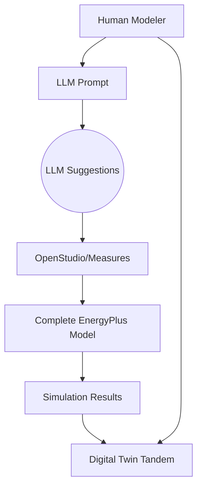

# LLM-Assisted BIM Data Extraction for Digital Twin Energy Management

## 1. Overview of BIM-to-Energy Workflow

Revit models often export geometric and material data via gbXML, which can then be translated into simulation-ready formats (IDF or OSM) for EnergyPlus. However, detailed HVAC, schedules, or thermal properties are often missing. LLMs can assist by:
- Parsing gbXML sections to identify spaces, surfaces, and materials.
- Suggesting or retrieving missing data (e.g., typical schedules, R-values) from reference databases.
- Generating automation scripts (e.g., OpenStudio Measures).

```mermaid
flowchart LR
  A[Revit Model] --> B[gbXML Export]
  B --> C[OpenStudio / gbEplus]
  C --> D[Base OSM / IDF]
  D --> E[EnergyPlus Simulation]
  E --> F[Energy Results]
  D --> G[Digital Twin Tandem]
  F --> G
````

---

## 2. LLM Use Cases

1. **Data Enrichment**: LLMs can match partial BIM labels (e.g., “8in Concrete Wall”) with standard material properties or occupant schedules.
2. **Code Generation**: Prompting the LLM to write Ruby/Python scripts that configure HVAC systems or set schedules in OpenStudio.
3. **Quality Checks**: LLMs can highlight missing surfaces or duplicated geometry but should not replace geometry engines.

```mermaid
flowchart LR
  A1[(gbXML Data)] --> B1{{LLM}}
  B1 --> C1[Enriched Info]
  A1 --> D1[Parser/Translator]
  D1 --> E1[OSM/IDF]
  C1 --> E1
```

---

## 3. Hybrid Workflow (Human + LLM)

A recommended approach is combining specialized tools with human oversight:

1. **Extract** geometry with OpenStudio’s gbXML translator.
2. **Refine** missing data (HVAC, schedules) using LLM suggestions.
3. **Review** by an energy analyst to ensure correctness.
4. **Simulate** in EnergyPlus.
5. **Integrate** results into a digital twin (Autodesk Tandem) to maintain live performance data.



---

## 4. Challenges

* **Geometry Complexity**: LLMs lack robust 3D calculation abilities.
* **HVAC Specifics**: Systems need precise definitions beyond generic text.
* **Hallucination Risk**: LLMs may invent data or produce invalid code.
* **Workflow Integration**: Chunking large gbXML files and verifying results is non-trivial.

---

## 5. Relevant GitHub Projects

* **`weilixu/gbEplus`**: Converts gbXML to IDF, allowing plugins for missing data.
* **`NREL/openstudio-gbxml-measures`**: Measures to import gbXML into OpenStudio.
* **`stevenkfirth/xgbxml`**: Python-based gbXML parser.
* **`mac999/BIM_LLM_code_agent`**: Early experiments using LLMs to query BIM data.

---

## Conclusion

LLMs can streamline BIM-to-energy workflows by interpreting gbXML data, suggesting missing model inputs, and automating repetitive scripting tasks. When combined with robust tools (OpenStudio, EnergyPlus) and a digital twin platform like Autodesk Tandem, this approach bridges design and operations in a more intelligent, integrated manner.

